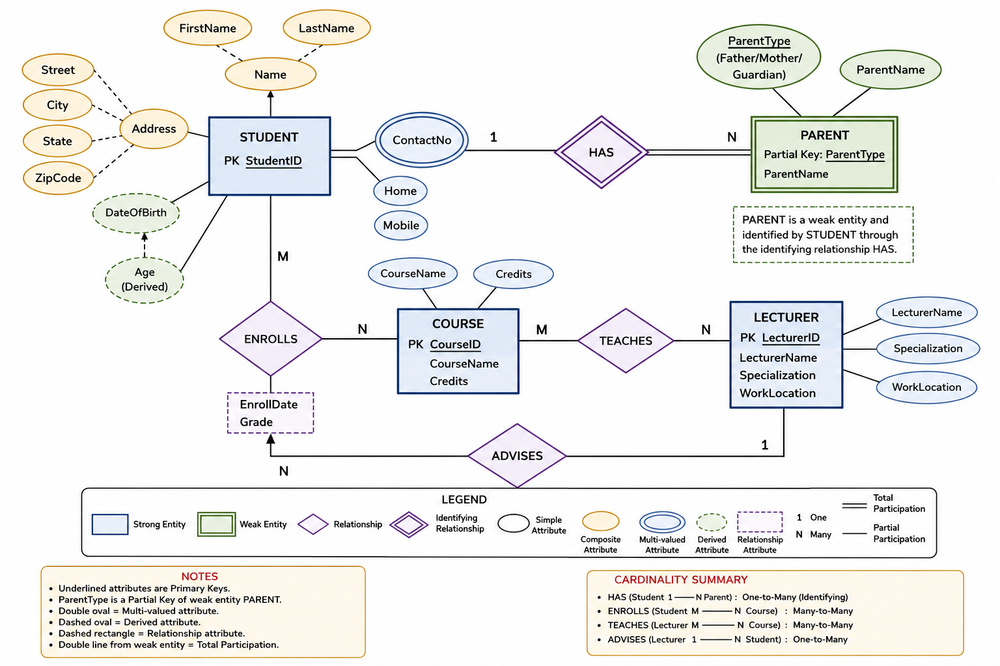

# STEMLink - Database - Day 5

# University Database System – ERD Analysis

## Scenario

A university wishes to develop a database system to manage information related to students, parents, lecturers, courses, and enrollments.

The university stores details of each student, including:

* Student ID
* Name

  * First Name
  * Last Name
* Address

  * Street
  * City
  * State
  * ZIP Code
* Contact Numbers

  * Home Number
  * Mobile Number
* Date of Birth

**Age** of the student is calculated from the provided date of birth.

Each student may have one or more parents or guardians. For each parent, the university records the **parent type** (e.g., Father, Mother, Guardian).

The university offers multiple courses. Each course has:

* Course ID
* Course Name
* Number of Credits

Students can enroll in multiple courses, and each course can be taken by many students. The university records:

* Enrollment Date
* Grade Obtained

The university employs lecturers. For each lecturer, the university stores:

* Lecturer Name
* Specialization
* Work Location

A lecturer may teach multiple courses, and a course may be taught by multiple lecturers.

---

# 1. Entities and Attributes

## Student

**Primary Key:** StudentID

### Attributes

* StudentID (PK)
* Name (Composite)

  * FirstName
  * LastName
* Address (Composite)

  * Street
  * City
  * State
  * ZIPCode
* ContactNumber (Multivalued)

  * HomeNumber
  * MobileNumber
* DateOfBirth
* Age (Derived)

---

## Parent

**Primary Key:** ParentID

### Attributes

* ParentID (PK)
* ParentName
* ParentType

---

## Course

**Primary Key:** CourseID

### Attributes

* CourseID (PK)
* CourseName
* Credits

---

## Lecturer

**Primary Key:** LecturerID

### Attributes

* LecturerID (PK)
* LecturerName
* Specialization
* WorkLocation

---

## Enrollment (Associative Entity)

**Primary Key:** (StudentID, CourseID)

### Attributes

* StudentID (FK)
* CourseID (FK)
* EnrollmentDate
* Grade

---

# 2. Primary Keys

| Entity     | Primary Key         |
| ---------- | ------------------- |
| Student    | StudentID           |
| Parent     | ParentID            |
| Course     | CourseID            |
| Lecturer   | LecturerID          |
| Enrollment | StudentID, CourseID |

---

# 3. Relationships

## Student – Parent

**Relationship:** Has

* A student can have one or more parents/guardians.
* A parent can be associated with one or more students.

### Cardinality

M : N

### Participation

* Student → Total Participation
* Parent → Partial Participation

---

## Student – Course

**Relationship:** Enrolls In

* A student can enroll in many courses.
* A course can have many students.

### Cardinality

M : N

### Relationship Attributes

* EnrollmentDate
* Grade

### Associative Entity

Enrollment

### Participation

* Student → Partial Participation
* Course → Partial Participation

---

## Lecturer – Course

**Relationship:** Teaches

* A lecturer may teach many courses.
* A course may be taught by many lecturers.

### Cardinality

M : N

### Participation

* Lecturer → Partial Participation
* Course → Partial Participation

---

# 4. Cardinality and Participation Constraints

| Relationship | Cardinality | Student | Parent  | Course  | Lecturer |
| ------------ | ----------- | ------- | ------- | ------- | -------- |
| Has          | M:N         | Total   | Partial | -       | -        |
| Enrolls In   | M:N         | Partial | -       | Partial | -        |
| Teaches      | M:N         | -       | -       | Partial | Partial  |

---

# 5. ERD Components Identification

## Primary Keys

* StudentID
* ParentID
* CourseID
* LecturerID

---

## Composite Attributes

### Student

Name

* FirstName
* LastName

Address

* Street
* City
* State
* ZIPCode

---

## Multivalued Attributes

### Student

ContactNumber

* HomeNumber
* MobileNumber

---

## Derived Attributes

### Student

Age

Derived from:

DateOfBirth

---

## Relationship Attributes

### Enrollment Relationship

* EnrollmentDate
* Grade

---

# 6. Text-Based ERD

```
STUDENT
--------
PK StudentID
Name
  - FirstName
  - LastName
Address
  - Street
  - City
  - State
  - ZIPCode
{ContactNumber}
DateOfBirth
Age (Derived)

        M:N
STUDENT -------- HAS -------- PARENT
                               -------
                               PK ParentID
                               ParentName
                               ParentType

        M:N
STUDENT ----- ENROLLMENT ----- COURSE
              -----------
              PK,FK StudentID
              PK,FK CourseID
              EnrollmentDate
              Grade

                               -------
                               PK CourseID
                               CourseName
                               Credits

        M:N
LECTURER ----- TEACHES ----- COURSE

LECTURER
---------
PK LecturerID
LecturerName
Specialization
WorkLocation
```

---




---

# ERD Notation Summary

* **PK** → Primary Key
* **FK** → Foreign Key
* **Composite Attribute** → Name, Address
* **Multivalued Attribute** → ContactNumber
* **Derived Attribute** → Age
* **Relationship Attributes** → EnrollmentDate, Grade
* **Cardinality** → M:N for Has, Enrolls In, and Teaches relationships

```
```
